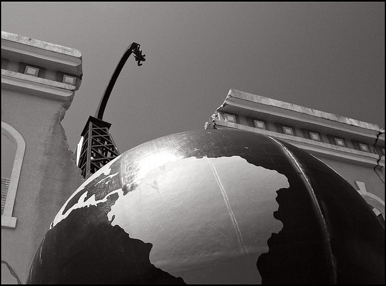
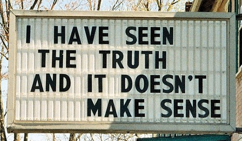
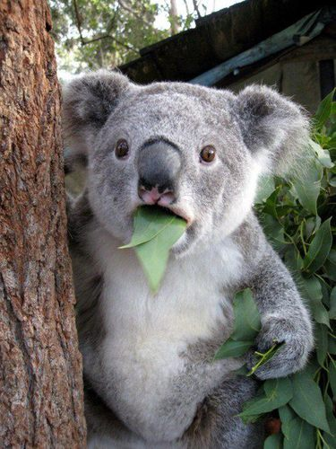
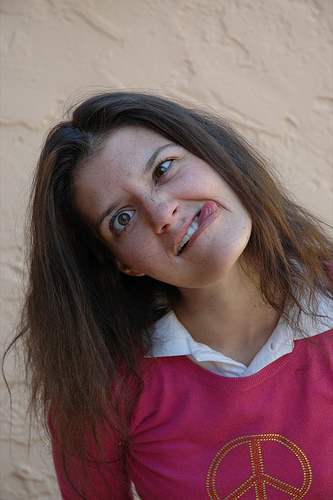
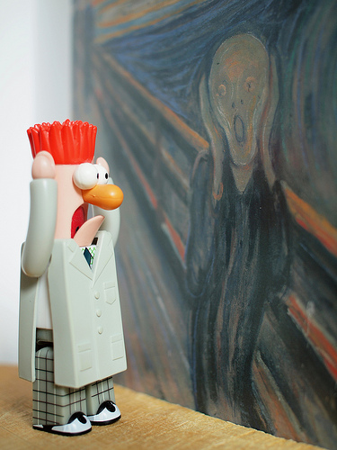

!SLIDE

    @@@javascript
    a = 1;

    (function() {
      b = 1;
    })();

    var c = 1;

    (function() {
      var d = 1;
    })();

!SLIDE center

# Globalização

<a class='cc' href='https://secure.flickr.com/photos/anjan58/1281306048/'>CC-BY-NC-ND anjan58 @ Flickr</a>

!SLIDE

    @@@javascript
    (function() { return({ a: 2 }) })
    ({ a: 1 }).a

!SLIDE

    @@@javascript
    (function() { return({ a: 2 }) });
    ({ a: 1 }).a;

!SLIDE center

<a class='cc' href='http://awkwardfamilyphotos.com/page/11/'>Licença desconhecida @ Akward Family Photos</a>

!SLIDE

    @@@javascript
    var class = Dog;

!SLIDE

# Palavras reservadas

    break       case        catch       continue
    default     delete      do          else
    false       finally     for         function
    if          in          instanceof  new
    null        return      switch      this
    throw       true        try         typeof
    var         void        while       with

!SLIDE

# Palavras reservadas **para uso futuro**

    class       enum        export      extends
    import      super

!SLIDE center

<a class='cc' href='http://vi.sualize.us/savingoldlittervia_photosmag_billboards_text_truth_humor_picture_2dJC.html'>Licença desconhecida @ vi.sualize.us</a>

!SLIDE

    ""           ==   "0"
    0            ==   ""
    0            ==   "0"
    false        ==   "false"
    false        ==   "0"
    false        ==   undefined
    false        ==   null
    null         ==   undefined
    " \t\r\n"    ==   0

<a class='cc' href='http://bonsaiden.github.com/JavaScript-Garden/#types.equality'>JavaScript Garden: Equality and Comparisons</a>

!SLIDE

    ""           ==   "0"           // false
    0            ==   ""            // true
    0            ==   "0"           // true
    false        ==   "false"       // false
    false        ==   "0"           // true
    false        ==   undefined     // false
    false        ==   null          // false
    null         ==   undefined     // true
    " \t\r\n"    ==   0             // true

<a class='cc' href='http://bonsaiden.github.com/JavaScript-Garden/#types.equality'>JavaScript Garden: Equality and Comparisons</a>

!SLIDE center

<a class='cc' href='https://pinterest.com/pin/294985844312254486/'>Licença desconhecida @ Pinterest</a>

!SLIDE

    @@@javascript
    (function() {
      nop();
      function nop() {};
    });

!SLIDE

    @@@javascript
    if (true) {
      function declaration() {
        return "first";
      }
    } else {
      function declaration() {
        return "second";
      }
    }
    declaration();

<a class='cc' href='http://arcturo.github.com/library/coffeescript/07_the_bad_parts.html'>The Little Book on CoffeeScript: The Bad Parts</a>

!SLIDE center

<a class='cc' href='https://secure.flickr.com/photos/thestarmama/69575266/'>CC-BY StarMama @ Flickr</a>

!SLIDE

    @@@javascript
    9.toString();

!SLIDE

    @@@javascript
    var a = 1;

    (function() {
      console.log(a);
      var myvar = 2;
    })();

!SLIDE center

<a class='cc' href='http://thewhizzer.blogspot.com.br/2010/01/i-had-bad-day-today.html'>CC-BY Whizzers @ blogspot</a>

!SLIDE

    @@@javascript
    2 + '2' // '22'
    2 - '2' // 0
    2 * '2' // 4
    2 / '2' // 1

!SLIDE

    @@@javascript
    [] + []
    [] + {}
    [] + 1

!SLIDE

    @@@javascript
    {} + {}
    {} + []
    {} + 1
    1 + {}

!SLIDE

    @@@javascript
    [] - 1
    [1] - 1
    [1,2] - 1

!SLIDE center

<a class='cc' href='https://secure.flickr.com/photos/gurooo/5746534088/'>Copyright - All rights reserved by Gurooo</a>
